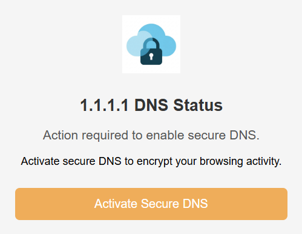
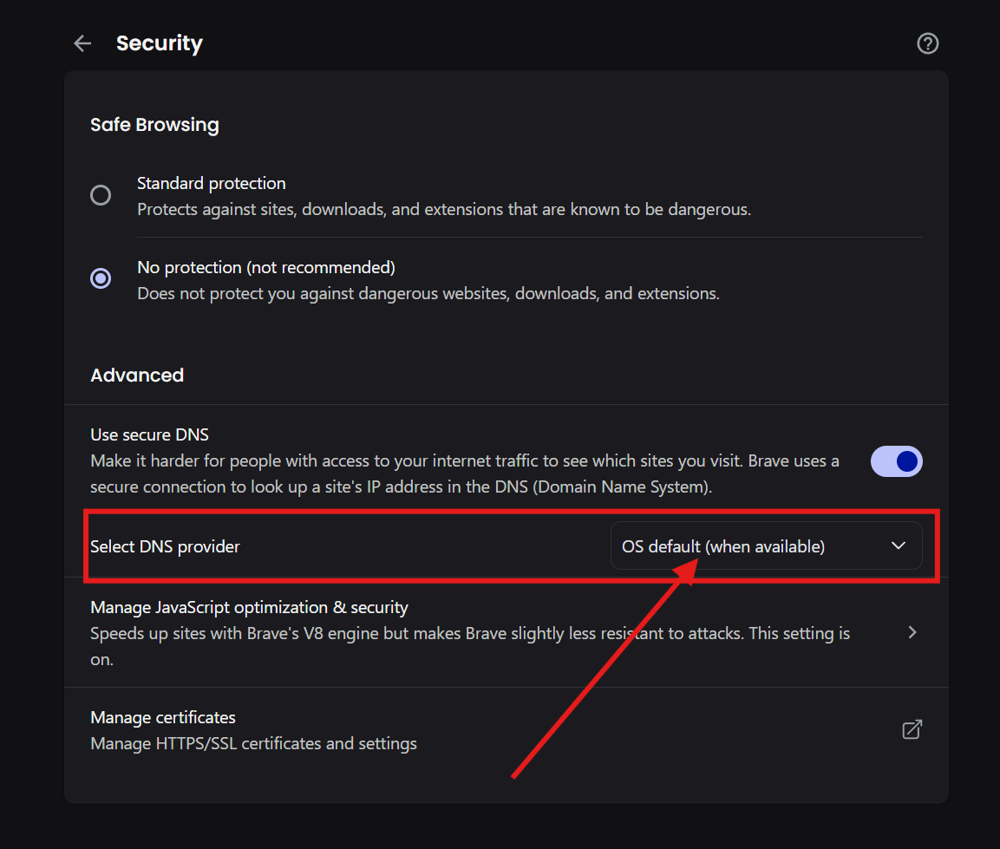
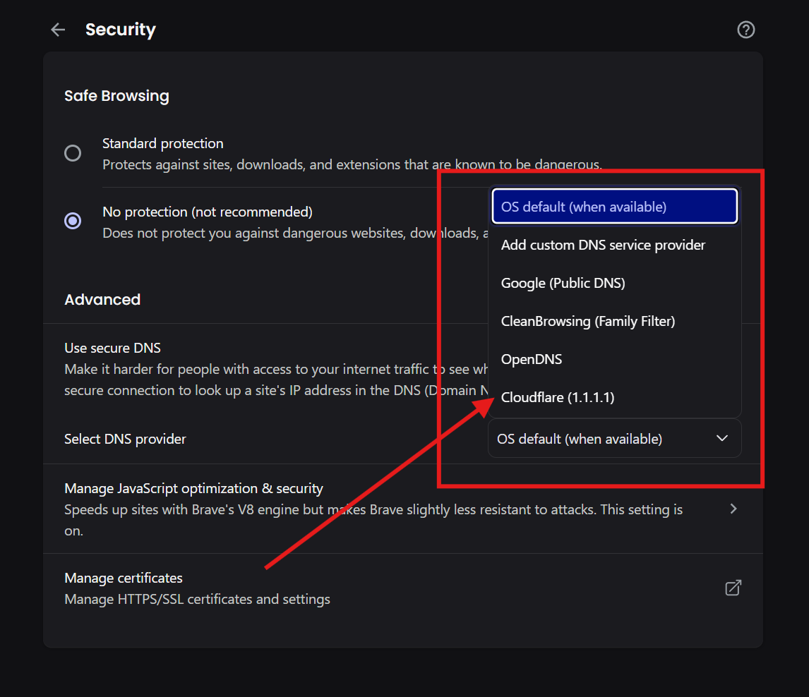
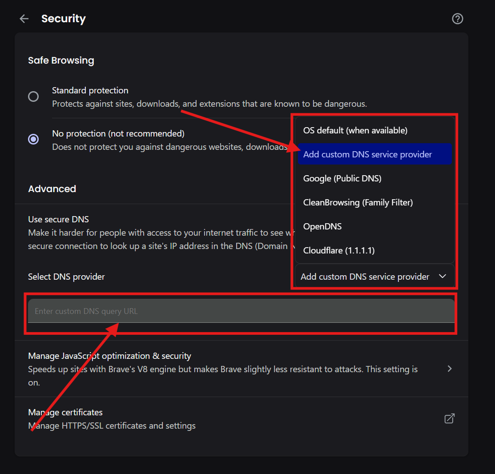
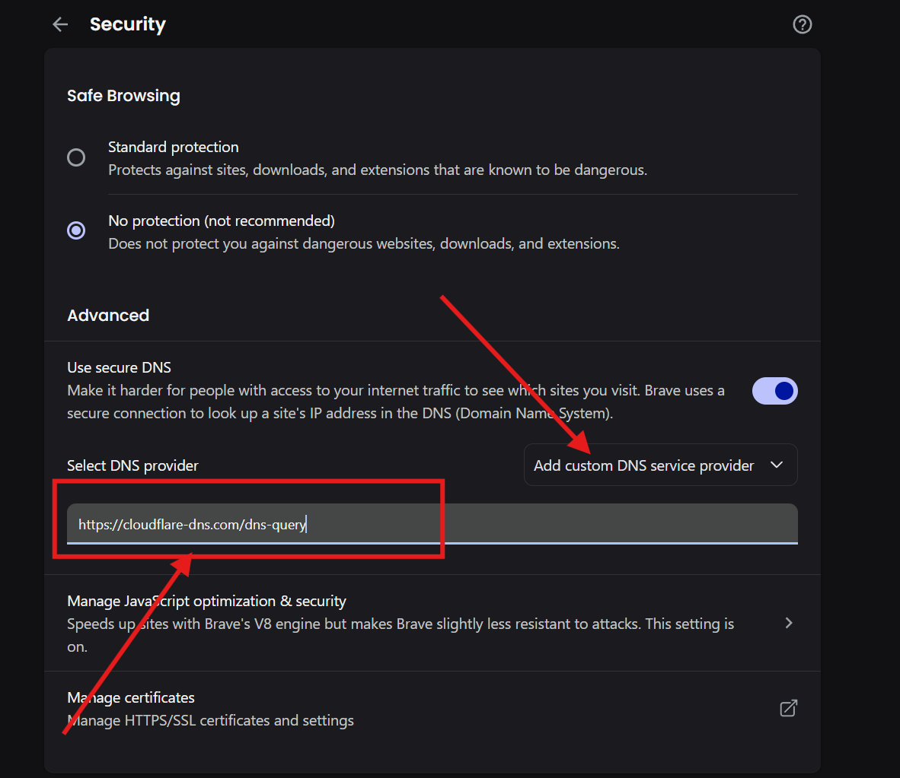

# 1.1.1.1 DNS Helper (Chromium Browser Extension) ☁️🔒

A simple, lightweight, and open-source browser extension that helps you switch to Cloudflare's 1.1.1.1 DNS service for a faster and more private internet experience.

---

 

---

## ## Features

* **🚀 One-Click Setup:** Streamlines the process of enabling DNS-over-HTTPS in Chromium Browser.
* **🔐 Enhance Privacy:** Encrypts your DNS queries, preventing your ISP or anyone on your local network from snooping on your browsing history.
* **⚡️ Improve Speed:** Leverages Cloudflare's global network, one of the fastest public DNS resolvers in the world, to speed up website loading times.
* **🌍 Bypass Censorship:** Helps you access content that might be blocked by your local ISP's DNS filters.
* **✨ Lightweight & Simple:** No logins, no complicated settings. Just a simple, effective tool.
* **📖 Free & Open Source:** Built for everyone, with a transparent codebase.

---
## ## Why a "Helper"? (Chromium Browser vs. Firefox)

Due to **Chromium Browser's security policies**, extensions are not allowed to change core security settings like your DNS provider automatically. This is a safety feature to protect you from malicious extensions.

Therefore, this extension acts as a **"helper"**. It makes the manual process incredibly simple by automating two key steps:
1.  It opens the correct settings page for you.
2.  It copies the required Cloudflare URL to your clipboard.

This turns a confusing task into a simple one-click-and-paste action. The Firefox version of this add-on can automate the process completely due to different extension APIs.

---
## ## Installation

#### #### Option 1: From the Chromium Browser Web Store (Recommended)

*(Coming Soon!)* - Once published, you'll be able to install this with a single click from the official store.

#### #### Option 2: Manual Installation (For Developers)

1.  **Download the Code:** Clone this repository or download it as a ZIP file and unzip it.
2.  **Prepare the Manifest:** Make sure the file `manifest.chrome.json` is renamed to `manifest.json`.
3.  **Open Chromium Browser Extensions:** Open Chromium Browser and navigate to `chrome://extensions`.
4.  **Enable Developer Mode:** Turn on the "Developer mode" toggle in the top-right corner.
5.  **Load the Extension:** Click the **"Load unpacked"** button and select the project folder. The extension will now be active.

---
## ## How to Use

1.  **Click the Icon:** After installing, click on the 1.1.1.1 DNS Helper icon in your browser's toolbar.
2.  **Activate:** Click the large **"Activate Secure DNS"** button in the popup.
3.  **Paste the URL:** A new tab will open to your Chromium Browser settings. The Cloudflare URL has already been copied to your clipboard.
    * Find the "Use secure DNS" option.
    
    * You can use the **Cloudflare Option if you have** as shown in the image or go with the custom.
    
    * Select the "With Custom" radio button.
    
    * Paste the URL (`https://cloudflare-dns.com/dns-query`) into the text field.
    

That's it! Your browser's DNS queries are now secure.

---
## ## Contributing

Contributions are welcome! If you have ideas for new features, improvements, or have found a bug, please feel free to:

1.  Open an issue to discuss the change.
2.  Fork the repository and create a new branch.
3.  Make your changes and submit a pull request.

---
## ## License

This project is licensed under the **MIT License**. See the `LICENSE` file for details.

---
## ## Acknowledgments

* A big thank you to **Cloudflare** for providing the free, fast, and private 1.1.1.1 public DNS service.

## ## For Firefox we'll be launching soon.